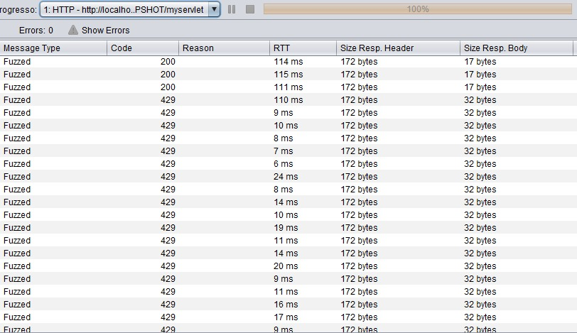

# java-rate-limit

This is a simple Java rate limit to HTTP request.

_Rate limiting refers to preventing the frequency of an operation from exceeding some constraint. In large-scale systems, rate limiting is commonly used to protect underlying services and resources._

Definition by: [_Google Cloud Architecture_](https://cloud.google.com/architecture/rate-limiting-strategies-techniques)

This project has been tested and confirmed to work with `Java 6` and `Java 8`, but may also work with other versions of Java. However, these other versions have not been tested.

## Usage

1. Build the project with the command `mvn package`.
2. Deploy the generated `.war` file located in the `target` directory to the `webapps` directory of your Tomcat installation.
3. Start the Tomcat server by running the `startup` script located in the `bin` directory of your Tomcat installation.

## Additional Configuration

You may need to modify the `pom.xml` file to add any necessary dependencies for your project. You can also modify the `web.xml` file located in the `src/main/webapp/WEB-INF` directory to configure your servlets and mappings.

If you need to configure any additional settings for your Tomcat installation, you can do so in the `conf` directory of your Tomcat installation.

## Demonstration

This is a demonstration of rate limit working in an attack started by Owasp Zap tool with 5 threads requests.



## Instructions to use

1. Add `RateLimit` class in your project.
2. Create an instance of the RateLimit class and run the doFilter method around your HTTP endpoint.

```
    ...
    rateLimit = new RateLimit();
    ...

    if (rateLimit.doFilter(request)) {
        json = "{\"message\": \"ok\"}";
        response.setStatus(200);			
    } else {
        json = "{\"message\": \"too many requests\"}";
        response.setStatus(429);
    }

```

For more details, see the example of the `MyServlet` class.

## Contributing

If you want to contribute to this project, please follow the guidelines below:

1. Fork the repository.
2. Create a new branch: `git checkout -b <my-new-branch>`
3. Make changes and test them.
4. Add the changes: `git add .`
5. Commit your changes: `git commit -m "Add some feature"`
6. Push to the branch: `git push origin <my-new-branch>`
7. Submit a pull request to the original repository.

## License

This project is licensed under the [MIT License](https://opensource.org/licenses/MIT).
